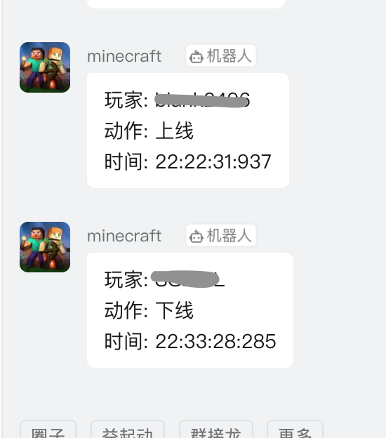

# minecraft_dingding_msg

## Screenshot
    

## How to use?
1. copy this script to your minecraft server
2. add webhook robot in dingding group
3. modify WEB_HOOK、MINECRAFT_PATH、LOG_NAME to your own
4. sudo +x chmod ./send_to_dd.sh
5. add timer in crontab

